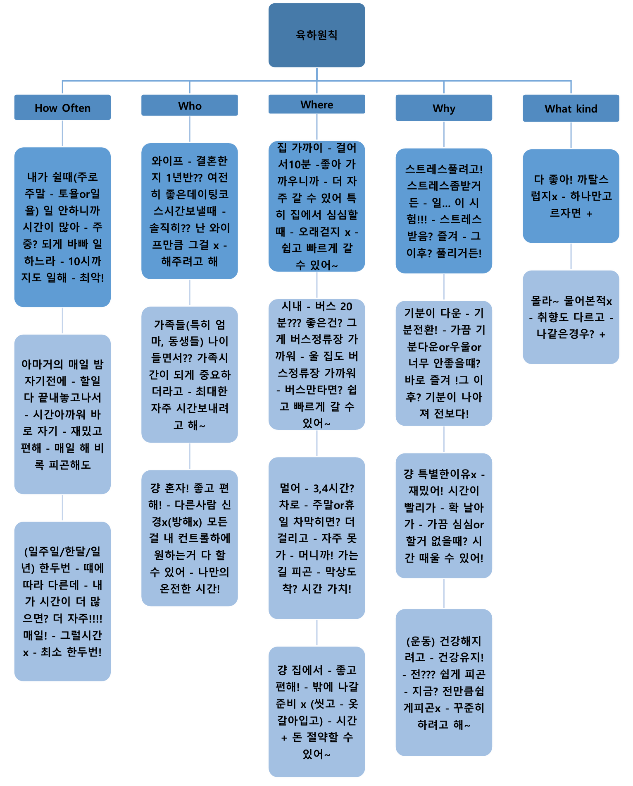

# 오픽 시험

## Background Survey
- 현재 귀하는 어느 분야에 종사하고 계십니까?
  - 일 경험 없음
- 당신은 학생입니까?
  - 아니오
  - 졸업한지 5년 이상 됨
- 현재 귀하는 어디에 살고 계십니까?
  - 가족(배우자/자녀/기타 가족 일원)과 함께 주택이나 아파트에 거주
- 귀하는 여가 활동을 주로 무엇을 하십니까?
  - 영화/공연/콘서트/공원/해변
- 귀하의 취미나 관심사는 무엇입니까?
  - 음악/수영/자전거/조깅/걷기/운동을 안함
- 귀하는 어떤 휴가나 출장을 다녀온 경험이 있습니까?
  - 집에서 보내는 휴가

## 참고 표
| 문제         | 동사   | 주제                     | 장소                                    |
|--------------|--------|--------------------------|----------------------------------------|
| 영화         | watch  | Movie                    | Movie theater, cinema                  |
| 영화         | watch  | Concert                  | Concert hall                           |
| 영화         | watch  | Performance              | Performance hall, theater              |
| 자전거       | ride   | bike/bicycle             | Park                                   |
| 수영         | go     | swimming                 | Swimming pool, beach, hotel            |
| 조깅         | go     | jogging, running         | Park                                   |
| 걷기         | go     | walking, taking a walk   | Park                                   |
| 쇼핑         | go     | shopping                 | Shopping mall, department store, flea market, Costco |
| 외식         | go     | eating out + dinner/lunch/brunch | Restaurant                     |
| 도서관       | go     | read a book              | Library                                |
| 호텔         | go     | eating out / swimming / spa | Hotel restaurant, swimming pool, sauna, spa |
| 약속         | have   | appointments             |                                        |
| 휴가         | have   | vacation                 | during vacation, i enjoyed (주제) with my wife |
| 집 휴가      | have   | vacation at home         | instead of staying home, i went out to enjoy (주제) with my wife |

## 최근 경험

### 선택 주제
- 영화, 콘서트, 공연, 쇼핑, 수영, 자전거, 조깅, 걷기, 집 휴가

### 돌발 주제
- 외식, 도서관, 약속, 휴가, 호텔

### 키워드
- recent, recently, last time, lastly + was/did/were (과거 동사)

### Script
최근에..… 그게was …. (생각) one of지난 휴일 중 하루였는데which was(생각) 정확하게 일요일이었다.. 그때(at that time) 내가 마지막으로(lastly)went to (장소)에 가서& enjoyed (주제)를 했어 with울 와이프랑.. 왜냐면.. 어… 실은… 나랑 & 와이프 둘 다(both) like (주제)를좋아하거든! 그래서 당연히(obviously) 우리가 그걸 즐겨 꽤(pretty) 자주(often) whenever we have some free(=spare)시간 날때마다 만약 there is no other 특별한 계획이 없으면..

그런데… 그날은(that day)… 내가 didn’t plan it 미리(in advance) 계획을 하거나 그런건 아녔어... 그니까(I mean) 내가 먼저(firstly) took a쉬었지(rest) at집에서…(뭐했더라 생각…) 아마… watching 유튜브 보고??.. 그냥(just) killing my 시간 때우고 ㅋㅋㅋ 근데 내가 started to feel 약간 심심하더라고(bored) as 시간이 지날수록(went by)… 그래서 that's why 내가 먼저(firstly) 제안했어(suggested) 와이프한테to enjoy(주제)하자고 했어... 와이프는 (생각) she said.. 뭐.. ok했지 바로(right away)

그리고 실은..내가 좋아하는 (장소)이 있어~there is my favorite(장소)가 있어 which is called (상호명)이라고.... 왜냐면 … 그게 the best place to (주제)하기에 최고의 장소기도 하고…. the 분위기가(mood) is so 에너제틱하거든~.. which makes me 내 기분도(feel like) 에너지 넘치게 만들어 too ㅋㅋ. 그래서 그날.. 내가 had a 좋은 시간을 보냈어in거기(there)에서.. enjoying (주제)도 하고 얘기도 하고 어쨌든 그건 was 진짜(definitely) 좋았어~

## 계기 변화

### 선택 주제
- 수영, 자전거, 조깅, 걷기, 음악, 영화, 쇼핑

### 돌발 주제
- 독서, 인터넷 서핑, 테크놀로지

### 키워드
- first, become interested, interest developed/changed, how did you learn, first time, first experience, first impression

### Script
어….. 이거 너무(too) 어렵다(to)대답하기(answer)… 어… 내 첫 (주제)..?? 어…. 나 cannot even answer in한글로도 대답 못하겠는데..? 왜냐면.. 나 기억이 잘 안나(~remember) 언제(when) 내가 went to(장소)에 갔었는지 첨으로(for the first time).. 왜냐면..….. 그게was…. 당연히(obviously) 너~무(too) 오래전이거든…. 한(about…)(생각)…. 30년 전? 최소(at least)..???..어쨌든.. 한가지(one thing) that 내가 am 확신할 수 있는 건(sure).. is 그건 was.. when내가was 엄청(much) 어릴때야(younger) 당연히(obviously)..than지금보단 

그때.. 아마.. 내가 첨으로(firstly) went to(장소)에 갔을거야.. (생각……..) 아! With my부모님이랑.. 그니까(I mean) my 가족들이랑 다(all)~ 같이(together)! including 내 여동생들을 포함해서.. 아, 왜냐면 내가 have 여동생 둘이 있어서… 부모님이took 우리를(us) 데리고to (장소)에 가셨지.. 왜냐면.. 어… 아마… 내가 said,, I wanted to가고(go) 싶다고 말한거같아! 어… 아, 그리고 as내 기억에(remember)… 우리 부모님이 used to spend 시간을 with 우리랑(us) 되게 자주(frequently=often) 보내셨어 whenever 부모님이 had free 시간 있을때마다.. 그니까(I mean) 부모님이 used to 데리고 다니셨어(take) 우리를(us) to many 좋은곳(good places)에 많이 데리고 다니셨어..예를들어(for example)..(생각)…. 동물원and 등등(so on)..??

근데 그땐.. as내가 말했다시피(said)... 내가 먼저(firstly) 말했을거야(said) let’s go to(장소)에 가자고...어쨌든 my첫 (first)느낌(feeling)은? (생각..)…그게was되게 새로웠어! 왜냐면 그거 was내 첫 시도(try)였으니까.. in 내 인생에서.. 어쨌든 나 여전히(still) like to go to (장소) 가는거 좋아해 until 지금(now)까지도!

- Used to 동사원형: ~ 하곤 했다
- Take 누구 to 어디 : 누구를 어디로 데리고가다

## 습관 묘사 / 육하원칙

### 요약

### When (how often)
- Like to / try to / tend to (+ v)
- 나 00해~when 내가 have 쉴 때(days off)… 그니까(I mean) 그건 주로 주말이야… 당연히 토요일 일요일에.. 왜냐면… 내가 일을 안해도 되니까! I have a lot of + free시간이 많아!! to do + what I 하는거(want) 할 수 있는.. 반면에 (but) during the주중에는? 나 am되게 바빠 일하느라ing(busy + 동사ing : 동사를 하느라 바쁘다)…. 요즘? 나 일하거든until 늦게까지..like.... 한… 10시까지? Which is 최악이야!
- 나 00해~ 아마.. 거의(almost… like) 매일 ? at밤에 before 내가 go to자기전에..after finishing + what 내가 해야 할 거(have to do) 끝내고 나서.. 왜냐면… 당연히 그게 재밌잖아.. 그리고 즐기기도 편하고(convenient to enjoy)….그리고.. 바로 자는게(going to bed + right away) is…….. waste of시간 아까워..나 try to do + 매일(everyday) 하려고 노력 해 비록(Although) 내가 feel 피곤해도
- 나 00해~ 아마… 한(once or)두번 (twice)정도? a(일주일week/한달month/일년에year) 그게 다르지depending on 상황(situation)에 따라..… 근데 만약 (if)내가have more 시간이 더 많다면? 물론 나 wanna enjoy 더(more) 자주(often) 하고싶지.. like… 매일! But 내가 시간이 많이 없어…. 그래서 나 해 최소 한두번은~~ 

### Where
- 내가 좋아하는 (장소)는
- 가까워 집이랑.. 한.. 10분? 걸려 걸어서… 좋아! 가까우니까! – 더 자주 갈 수 있어 원할때마다 특히 집에서 심심할 때  – 오래 걷지 않아도 되서 – 쉽고 빠르게 갈 수 있어~  
- 시내에 있어 – 한.. 20분? 걸려 버스타고… - 아, 근데 좋은게 뭐냐면, 그게 버스정류장이랑 가까워.. – 울 집도 가깝고 버스정류장이랑…. 내가 버스타기만하면? 쉽고 빠르게 갈 수 있어~ 
- 엄청 멀어 집에서.. – 한… 3~4시간 ?걸려 차타고 – 근데 휴일or주말에 차막히면? 더 걸려! 자주 못가 원하는만큼 – 너무 머니까! 가는길에 너무 피곤해 – 막상 도착하면? 되게 좋아! 시간가치 있어! 
- 나 00해~ 집에서 – 좋고 편해! – 내가 나갈 준비를 하지 않아도 되 – 예를들어.. 씻고.. 옷갈아입고 등등..???? – 시간 돈 절약할 수 있어 뭔가를 집에서 하면 – 너무 편해!

### Who
- Like to / try to / tend to (+ v)
- It has been 기간 that 주어 동사: 주어가 동사한지 어느정도의 기간이 되었다
- 나 00해~ 아내랑… 한….. It has been 1년 &반?? 정도 된거같은데 that우리가got 결혼한지.. but그게 여전히(still) 좋은 데이팅코스야 whenever우리가 spend 시간을 함께(together) 보낼때마다…but..  솔직히(honestly) 난don’t like it 그걸 as much as 와이프만큼은 안좋아해 ㅋㅋㅋ.. 그래도 I try to do it 같이(together) 하려고 노력해 for 와이프 위해서~(사랑하니까~)  
- 나 00해~ 가족들이랑…including 동생들 엄마랑 – 왜냐면 뭐랄까(how can I say)..… as내가 got나이 먹으면서.. spending time with 가족 시간이 seems 좀(more) 더 중요한거 같아..그니까 그게has 
become one of우선순위가 되더라고(my top priorities)…… 그래서 내가 노력해 시간을 보내려고 with가족들과 as often as최대한(possible) 자주.  
- 나 00해~ 혼자! Which is 너무(definitely) 좋고 & 편해! – 왜냐면 내가 don’t have to + care다른(other)사람을(people) 신경쓰지 않아도 되니까.. I don’t have to 방해 받지 않아도 되고(be 
disturbed) – 내가can do everything + that i 원하는걸(want) 다 할 수 있어…under내 컨트롤하에… - I can have나만의(my own) 온전한(me) 시간도 가질수 있어~

### What kinds(어떤 + 종류)
- 실은.. 나 like 모~든(all kinds of) (주제)를 좋아해.. 왜냐면 내가 am not그닥(that!) 까탈스럽진않거든(picky) in case of (주제)면에서는.. 근데 만약(if) 내가 have to+ choose + only하나만(one)고르자면? 제일좋은건(my favorite is….) (생각3초) ( ++) 야~
- 솔직히(honestly) 나 잘 몰라 어떤(what kinds of)(주제)을 다른(other)사람들이(people) 좋아하는지(like..) – 왜냐면 내가have never 물어본적이 없어(asked)  –and 당연히(obviously) 사람마다 가지고 있잖아 다른(different)취향(taste)을.. – 근데 나같은경우(in my case)? 난 like…(생각3초) (장르)가 좋아